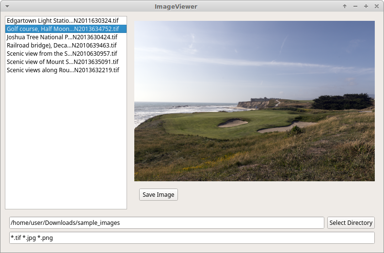
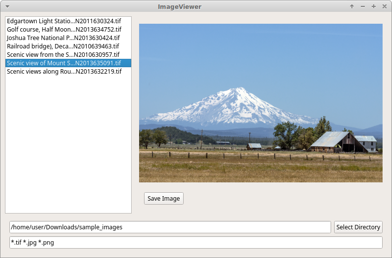

# ImageViewer
This repository contains an image processing library with a simple interface over it.

The library was designed for asynchronously accessing images and consists of two files: ImageLibrary.h and ImageLibrary.cpp

A graphical interface was built to demonstrate the functionality of the library. The entry point is in main.cpp but the bulk of the code is in mainwindow.cpp and its header file mainwindow.h.

From the GUI it is possible to list all images in a given directory, change directories, filter files by extension, view images, and save images to different filenames. The current directory is also monitored for changes and any newly added files are shown immediately.

**Screenshots** 

 
(Public domain images courtesy of [https://snappygoat.com](https://snappygoat.com))

**Asynchronous access to images** 
Direct access to the pixel data of an image is available through `ImageLibrary::loadImage`. A QImage object is returned which may be displayed on the screen or analyzed and manipulated. This project contains an example of asynchronously loading images and displaying them on the screen. Using the example as a guideline, additional versions of an image (or other images) may be displayed on the monitor(s) at a time. This may be especially useful when comparing images in a sequence or before/after versions of an image when manipulating it.

The images in the screenshots above were from a larger set of TIFF files ranging from 150MB - 250MB in size. With the non-blocking, asynchronous loading it was a breeze to skip around between images and still have an interactive interface.

**Polling the filesystem for changes** 
After setting a directory to watch, all file changes, additions, and deletions in that directory will instantly be reflected in the file list in the GUI.

**Saving images to TIFF (or other image formats)** 
Basic asynchronous saving is implemented through `ImageLibrary::saveImage`. It will be more useful when advanced image editing techniques are added. As a proof-of-concept, when images are saved they are reduced to their pixel size as displayed on the screen. Viewing an image at its full resolution will save it at full resolution; viewing it at a lower resolution will save it at that lower resolution, creating a smaller file. Automatic type conversion occurs by specifying a different file extension when saving, e.g. .tif, .jpg, or .png.